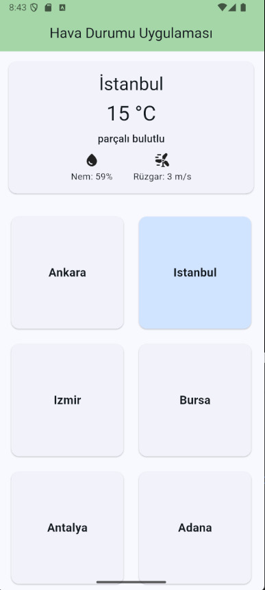

🌤️ Flutter Weather App
Flutter ile geliştirilmiş, OpenWeatherMap API kullanan şehir bazlı hava durumu uygulaması.
Kullanıcı seçtiği şehir için anlık sıcaklık, nem, rüzgar hızı ve hava durumu açıklamasını görebilir.

✨ Özellikler

- 📍 Türkiye’deki şehirler için hava durumu bilgisi
- 🌡️ Anlık sıcaklık, nem ve rüzgar hızı
- 🖼️ Hava durumuna göre dinamik kart tasarımı
- 🔑 API key yönetimi .env dosyası ile güvenli şekilde
- 🧩 Modüler yapı: services, widgets, pages, models

📂 Proje Yapısı

```text
lib/
├── main.dart
├── models/
│ └── weather_model.dart
├── services/
│ └── weather_service.dart
├── pages/
│ └── home_page.dart
└── widgets/
└── weather_card.dart

```

🚀 Kurulum

1. Repoyu klonla:

   ```bash
   git clone https://github.com/rafettcelikk/Flutter-Weather-App.git

   ```

2. Proje klsörüne gir:

   ```bash
   cd Flutter-Weather-App

   ```

3. Paketleri yükle:

   ```bash
   flutter pub get

   ```

4. Uygulamayı çalıştır:

   ```bash
   flutter run

   ```

- .env dosyası oluştur:

OPENWEATHER_API_KEY=YOUR_API_KEY_HERE

- ⚠️ .env dosyası .gitignore içinde olmalı. Repo’ya sadece .env.example ekleyebilirsin.

📸 Ekran Görüntüsü

## 📸 Ekran Görüntüsü



🛠️ Kullanılan Teknolojiler

- Flutter
- Dio
- flutter_dotenv
- OpenWeatherMap API
